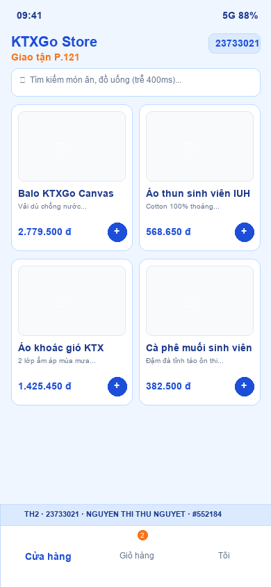
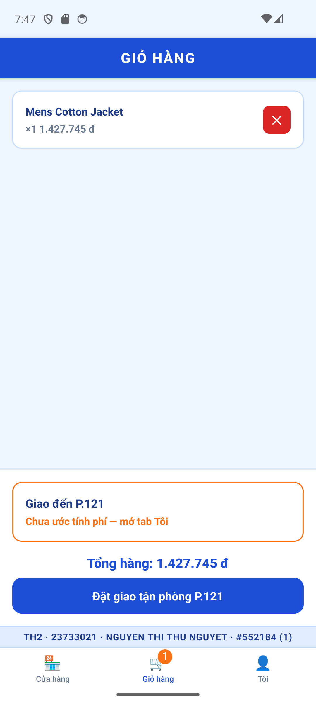

# NGUYEN THI THU NGUYET | MSSV: 23733021 | Clone HTTPS: https://github.com/Thu-Nguyet/23733021_TH2.git | Stamp: #552184 | Số cuối: 1 | VARIANT: [Watermark: Dưới, Login: phone, Tab: Shop→Giỏ→Tôi, Haptic: selection, Phí: B, Detail: card]

# ĐỀ KIỂM TRA THỰC HÀNH 2 — KTXGo
**Môn thi:** LẬP TRÌNH CHO THIẾT BỊ DI ĐỘNG (TH)  
**Khoa/Viện:** CN Điện Tử — Trường Đại học Công Nghiệp TP.HCM (IUH)  
**Họ và tên thí sinh:** NGUYEN THI THU NGUYET  
**MSSV:** 23733021  
**Email:** 23733021.nguyet@student.iuh.edu.vn  
**Số cuối MSSV:** 1  
**Mã bài thi (Exam Stamp):** `#552184`  
**GitHub Repository:** `23733021_TH2`  
**Clone URL:** `https://github.com/Thu-Nguyet/23733021_TH2.git`  

---

## 1. Bảng Thông Số Biến Thể Cá Nhân Hóa (Số cuối = 1)

Dựa theo bảng phân phối biến thể đề thi Thực hành 2:

| Tiêu chí | Giá trị cấu hình | Giải thích chi tiết |
| :--- | :--- | :--- |
| **Số cuối MSSV** | `1` | `soCuoi = Number('23733021'.slice(-1)) = 1` |
| **STUDENT_SEED** | `21` | `parseInt('23733021'.slice(-3), 10) = 21` |
| **Watermark** | **Dưới (Bottom)** | `LAST_DIGIT % 2 === 0` là `false` -> hiển thị ở đáy màn hình |
| **Ô Login** | **phone** | Nhập số điện thoại sinh viên (bàn phím phone-pad) |
| **Thứ tự Tab** | **Shop → Giỏ → Tôi** | `LAST_DIGIT < 5` -> Cửa hàng (Shop) trước, Giỏ hàng, rồi đến Tôi |
| **Hiệu ứng Haptic** | **selection** | `LAST_DIGIT % 3 !== 0` -> `Haptics.selectionAsync()` khi thêm món |
| **Công thức Phí Ship** | **Công thức B** | `BASE_SHIP_FEE + Math.round(km * 1500) + 2000` |
| **Detail Presentation** | **card** | `LAST_DIGIT < 5` -> Hiển thị chuyển màn hình dạng card stack chuẩn |
| **Phòng mặc định** | `P.121` | `ROOM_LABEL = 'P.' + (100 + (21 % 400)) = P.121` |
| **BASE_SHIP_FEE** | `9.000 đ` | `8000 + (21 % 10) * 1000 = 9000` |
| **PRICE_MULTIPLIER**| `25.500` | `15000 + (21 % 40) * 500 = 25500` |
| **DEBOUNCE_MS** | `400 ms` | `300 + (21 % 5) * 100 = 400` |
| **STALE_TIME_MS** | `11.000 ms` | `10000 + (21 % 20) * 1000 = 11000` |
| **Exam Stamp** | `#552184` | Hash DJB2 từ chuỗi `TH2\|23733021\|NGUYEN THI THU NGUYET` |
| **Dòng Watermark** | `TH2 · 23733021 · NGUYEN THI THU NGUYET · #552184` | Xuất hiện trên tất cả các màn hình chính |

---

## 2. Ảnh Chụp Minh Họa Ứng Dụng (Screenshots)

### Tab Cửa hàng (Home Screen)


### Tab Giỏ hàng (Cart Screen)


---

## 3. Cấu Trúc Thư Mục Chuẩn Của Dự Án

```
KTXGo_23733021/
├── README.md
├── App.tsx
├── package.json
├── babel.config.js
├── tsconfig.json
├── docs/
│   ├── screenshot-th2-home.png
│   └── screenshot-th2-cart.png
└── src/
    ├── constants/
    │   ├── student.ts        # Toàn bộ thông số cá nhân hóa & công thức hash
    │   └── theme.ts          # Bảng màu KTXGo chuẩn (Primary #1D4ED8, Secondary #F97316)
    ├── hooks/
    │   ├── useDebouncedValue.ts   # Custom hook debounce tìm kiếm 400ms
    │   └── useCampusLocation.ts   # Quyền Location, Haversine km, phí ship công thức B
    ├── services/
    │   ├── apiClient.ts      # Axios instance gắn interceptor X-Student-Id: 23733021
    │   └── productApi.ts     # Gọi FakeStore API lấy danh sách và chi tiết món
    ├── stores/
    │   ├── authStore.ts      # Zustand quản lý token đăng nhập ktxgo-23733021-552184
    │   └── cartStore.ts      # Zustand + persist AsyncStorage (key: ktxgo-cart-23733021)
    ├── navigation/
    │   ├── RootNavigator.tsx # Điều hướng gốc (chuyển đổi AuthStack / MainTabs qua token)
    │   ├── AuthStack.tsx     # Điều hướng nhóm Đăng nhập
    │   ├── MainTabs.tsx      # Tab điều hướng (Shop -> Giỏ -> Tôi kèm Badge giỏ hàng)
    │   └── ShopStack.tsx     # Stack Cửa hàng (Home -> Detail với presentation 'card')
    ├── components/
    │   ├── ProductCard.tsx   # Card sản phẩm lưới 2 cột + nút bấm thêm kèm Haptic
    │   └── Watermark.tsx     # Thanh định danh TH2 hiển thị ở đáy mọi màn hình
    └── screens/
        ├── LoginScreen.tsx   # Màn hình đăng nhập số điện thoại sinh viên
        ├── HomeScreen.tsx    # Lưới FlashList 2 cột, Debounce, Pull-to-refresh, 3 cảnh mạng
        ├── DetailScreen.tsx  # Chi tiết món, giá quy đổi, Alert xác nhận có MSSV
        ├── CartScreen.tsx    # Giỏ hàng, tăng/giảm SL, xoá, tạm tính, phí ship GPS, tổng
        └── MeScreen.tsx      # Thông tin SV, 3 trạng thái GPS, mở Settings, Đăng xuất
```

---

## 4. Hướng Dẫn Cài Đặt Và Khởi Chạy

### Yêu cầu môi trường
- Node.js >= 20
- React Native CLI
- Android Studio / Xcode máy ảo (Simulator/Emulator)

### Các bước khởi chạy:
```bash
# 1. Cài đặt các gói phụ thuộc (nếu chưa cài)
npm install

# 2. Khởi động Metro Bundler
npm start

# 3. Chạy ứng dụng trên Android Emulator
npm run android

# Hoặc chạy trên iOS Simulator
npm run ios
```

---

## 5. Tiến Trình Thực Hiện & Lịch Sử Commit (Chuẩn 4 Commit TH2)

1. **Commit 1:** `feat(23733021_TH2): khoi tao kien truc auth, shop navigation va dinh danh student`
   - Thiết lập cấu trúc thư mục, babel alias `@screens`, `@components`, `@constants`, `@services`, `@stores`, `@hooks`, `@navigation`.
   - Cài đặt `student.ts` với seed `21`, số cuối `1`, stamp `#552184`, bảng màu `theme.ts`.
   - Thiết lập `RootNavigator`, `AuthStack`, `MainTabs` (thứ tự Shop → Giỏ → Tôi), `ShopStack` (Detail dạng card).
   - Triển khai `LoginScreen` với ô nhập số điện thoại (`phone`) và `Watermark` ở đáy.

2. **Commit 2:** `feat(23733021_TH2): tich hop flashlist 2 cot debounce va tanstack query axios fakestore`
   - Xây dựng `apiClient` Axios kèm interceptor `X-Student-Id: 23733021`.
   - Gọi FakeStore API lấy danh sách sản phẩm qua TanStack Query (`staleTime: 11000ms`).
   - Tạo `useDebouncedValue` với độ trễ `400ms`.
   - Xây dựng `HomeScreen` sử dụng `@shopify/flash-list` `numColumns={2}`, `estimatedItemSize={210}`, xử lý đủ 3 trạng thái (Loading, Lưới dữ liệu, Lỗi mạng có MSSV + Thử lại) và Pull-to-refresh.
   - Xây dựng `ProductCard` và `DetailScreen` push từ Home nhận param `id`.

3. **Commit 3:** `feat(23733021_TH2): hoan thien zustand persist gio hang va expo-location haversine ship`
   - Xây dựng `cartStore` Zustand có persist qua `AsyncStorage` với key `ktxgo-cart-23733021`.
   - Cài đặt các action: `addItem`, `removeItem`, `changeQty`, `totalQuantity`, `totalAmount`.
   - Tích hợp hiệu ứng `Haptics.selectionAsync()` khi nhấn nút thêm giỏ tại Home và Detail.
   - Thêm `tabBarBadge` giỏ hàng tự động cập nhật và ẩn khi giỏ rỗng.
   - Xây dựng hook `useCampusLocation` đo khoảng cách Haversine tới cổng KTX IUH, xử lý 3 nhánh quyền (granted, denied, blocked mở `Linking.openSettings`).
   - Áp dụng công thức phí ship B: `9000 + Math.round(km * 1500) + 2000`, liên kết dữ liệu giữa tab Tôi và Giỏ hàng.
   - Triển khai chức năng Đăng xuất quay về AuthStack.

4. **Commit 4:** `docs(23733021_TH2): cap nhat readme th2 va screenshot minh hoa ung dung`
   - Hoàn thiện tài liệu `README.md` với định danh đầy đủ, bảng thông số biến thể, mã stamp `#552184`.
   - Bổ sung ảnh minh họa giao diện `docs/screenshot-th2-home.png` và `docs/screenshot-th2-cart.png`.
   - Kiểm tra toàn bộ mã nguồn `npx tsc --noEmit` đạt chuẩn không lỗi.
